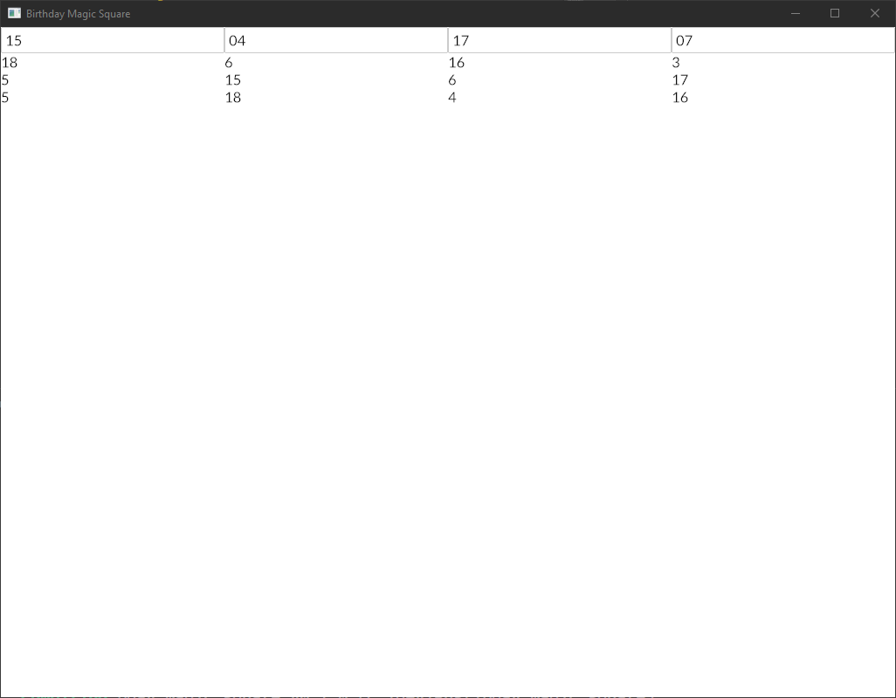

A Rust implementation of **Birthday Magic Squares** as described in [James Grime's video](https://youtu.be/hNn0j4Kay8g). Mainly made to test out [iced.rs](https://iced.rs/).

Here's what it looks like once all four inputs have a number:

